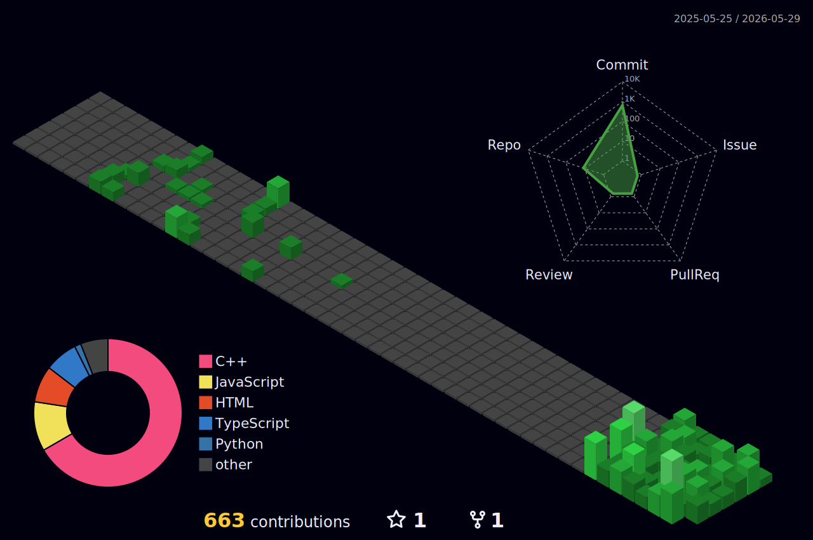

  

###

  

###

  
  
  

###

  

###

<h1 align="center">Hey there 👋, I'm Gajender</h1>
<h3 align="center">💻 Full Stack Developer | 🧠 AI & Web3 Explorer | 🇮🇳 India</h3>
  

<!-- <h3 align="left">👨‍💻 About Me</h3>

  I'm a 4th year B.Tech CSE student passionate about building full-stack apps with a focus on AI & Blockchain.
    
  - 🔭 Working on: <b>AI-Powered Learning Platform (AICademy)</b> 
  - 🌱 Currently learning: <b>DSA, MERN Stack, LLM Agents, Blockchain</b> 
  - 👯 Looking to collaborate on: <b>React / Node.js / AI Projects</b> 
  - 💬 Ask me about: <b>HTML, CSS, React, Firebase</b> 
  - 📫 Reach me at: <b>mandiwalgajender0001@gmail.com</b> 
  - ⚡ Fun fact: <b>I sometimes forget, but never give up 💪</b>

 -->

<h3 align="left">🔥 GitHub Dashboard</h3>

  
  
  
###

  

###

  

##

<h3 align="left">🧠 LeetCode Dashboard</h3>

##

<h3 align="left">🛠 Languages & Tools</h3>

  
  
  
  
  
  
  
  
  
  
  
  
  
  
  
  
  
  
  
  
  
  
  

##

<h3 align="left">💼 Featured Projects</h3>

<ul>
  <li><b>AICademy</b> – AI-Powered Course Generator using Gemini API + Firebase</li>
  <li><b>Skill Swap Platform</b> – React platform to exchange skills based on availability</li>
  <li><b>TrustBallot</b> – Blockchain-based secure voting system</li>
  <li><b>Real Estate Forecast</b> – ML model predicting housing prices</li>
</ul>

###

<h3 align="center">✨ Let's Build Something Awesome Together</h3>

  

